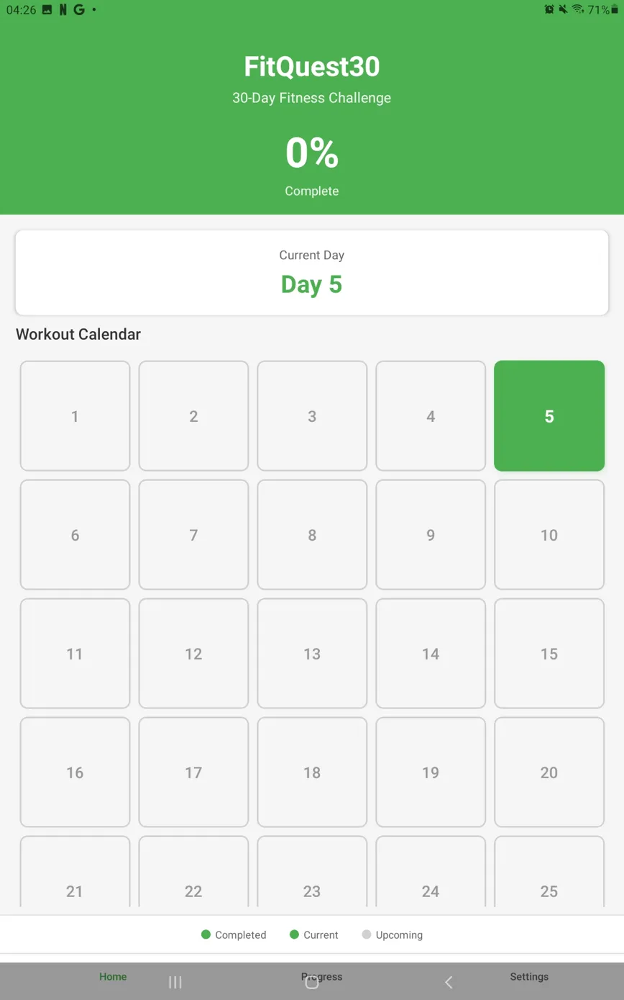
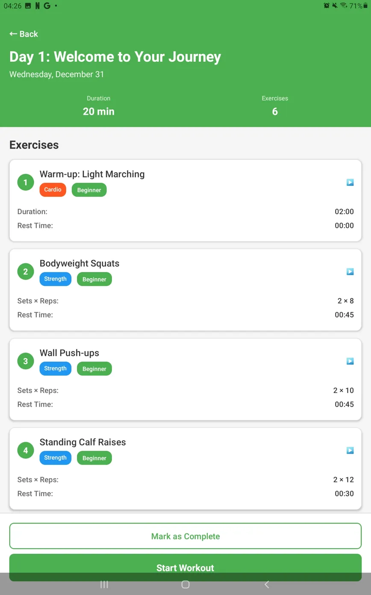

# 30-Day Fitness Mobile App

## Project Overview

Android fitness application providing daily workout routines with progress tracking over a 30-day period.

## Features

- Daily workout schedules
- Progress tracking
- JSON data management
- User-friendly interface
- Workout completion tracking

## Technologies Used

- **IDE:** Cursor IDE
- **Platform:** Android
- **Data Format:** JSON
- **Language:** Java/Kotlin

## Screenshots

## Key Learnings

- Mobile app development fundamentals
- JSON file handling and parsing
- Android UI/UX design
- App deployment (APK export)
- Data persistence in mobile apps

---

**Skills:** Android Development, JSON, Mobile UI/UX  
**Date:** 2025
