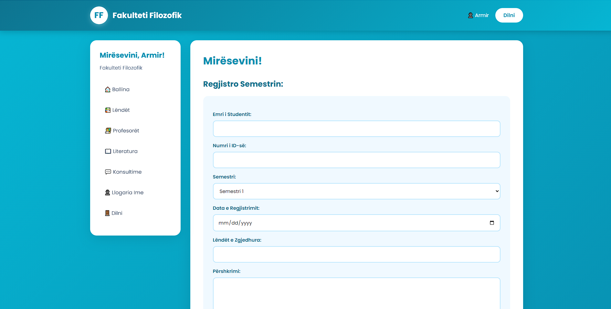
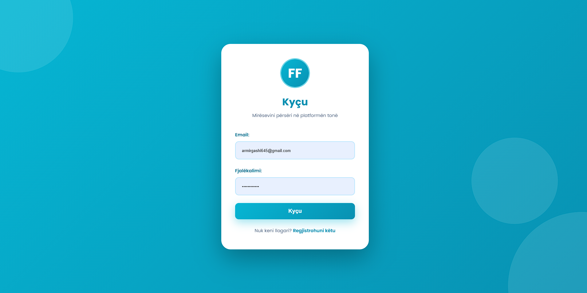
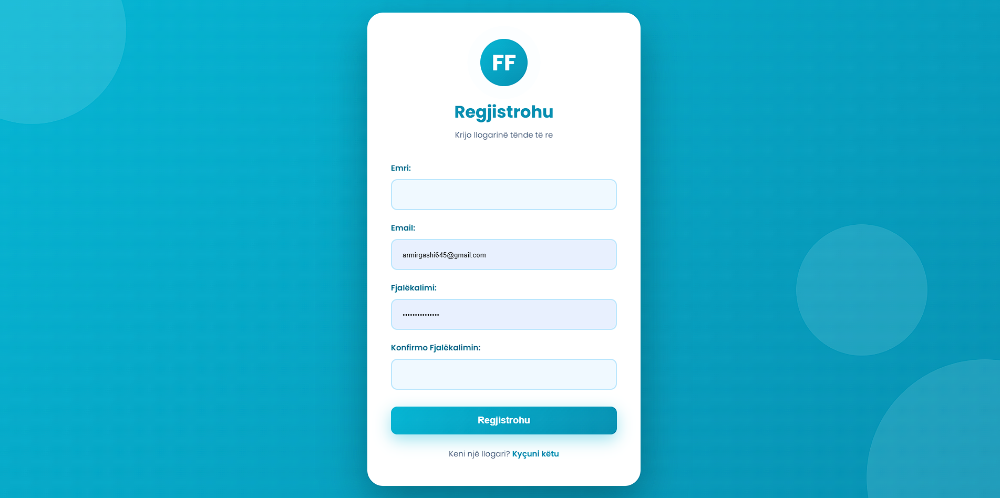

# Faculty Website (PHP + MySQL)

## 📋 Project Overview

Dynamic database-driven website for faculty management with full CRUD operations for student information, courses, and grades.

## Features

- Student information management
- Course enrollment system
- Grade tracking and reporting
- Faculty directory
- Responsive design

## Technologies Used

- **Backend:** PHP
- **Database:** MySQL
- **Frontend:** HTML5, CSS3, JavaScript
- **Server:** Apache (XAMPP)

## Screenshots

## Key Learnings

- Database design and normalization
- SQL query optimization
- Server-side authentication
- Form validation and security
- Session management
- CRUD operations implementation

---

**Skills:** PHP, MySQL, HTML, CSS, JavaScript, Database Design  
**Date:** 2025
